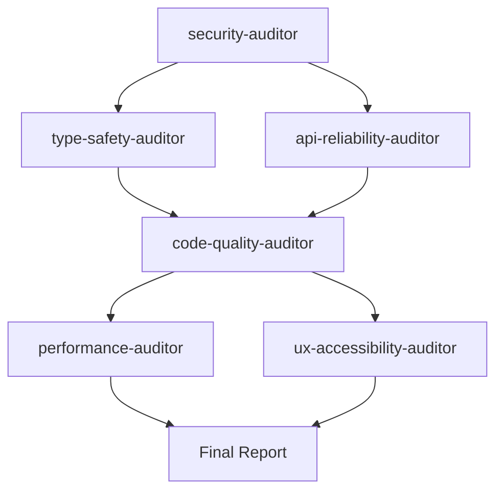

# AGENTS.md — Refract Audit Swarm

> This file defines the AI agent swarm that audits, improves, and maintains the Refract codebase.
> Each agent has a specific focus area, clear responsibilities, and knows how to coordinate with others.

---

## 🏗️ Project Context

**Refract** is a standalone AI code review tool built with:

| Layer | Stack |
|---|---|
| Frontend | React 18 + TypeScript (strict), Tailwind CSS v3, Framer Motion, Shiki v1 |
| Backend | Express 4 (minimal API proxy), multi-provider AI routing |
| Build | Vite 5, PostCSS, ESLint 9 |
| Providers | Anthropic, Groq, Mistral, DeepSeek, Gemini |

**Key directories:**
- `src/components/` — React UI components (Editor, Results, TopBar, IssueCard, ScoreRing, HistoryDrawer, EmptyState, ErrorBoundary)
- `src/lib/` — Utilities (api.ts, detect.ts, highlight.ts, history.ts)
- `src/types/` — TypeScript interfaces (analysis.ts)
- `server/` — Express proxy server with multi-provider routing

**Design system tokens** are defined as CSS custom properties in `src/index.css` (prefix: `--rf-*`).

---

## 🤖 Agent Definitions

### Agent 1: `security-auditor`

**Role**: Security & secrets scanner

**Responsibilities**:
- Scan for hardcoded credentials, API keys, tokens, and secrets in all files
- Verify `.env` is in `.gitignore` and never committed
- Audit CORS configuration in `server/index.ts` — ensure `origin` is not `*`
- Validate rate limiting is active and cannot be bypassed
- Check that all user input is sanitized server-side before reaching LLM APIs
- Verify no client-side code imports or exposes server-only secrets
- Audit `package.json` for known vulnerable dependency versions (`npm audit`)
- Check for XSS vectors in `dangerouslySetInnerHTML` usage (Editor.tsx highlight layer)
- Ensure clipboard API calls have proper error handling

**Trigger**: Run on every PR, on dependency updates, and weekly via scheduled audit.

**Output**: Security report with severity levels (CRITICAL / HIGH / MEDIUM / LOW) and fix suggestions.

**Commands**:
```bash
# Check for leaked secrets
git log --all --oneline -p | Select-String -Pattern "(API_KEY|SECRET|TOKEN|PASSWORD|PRIVATE_KEY)" -CaseSensitive
# Audit dependencies
npm audit --production
# Verify .env is ignored
git check-ignore .env
```

---

### Agent 2: `type-safety-auditor`

**Role**: TypeScript strictness & type coverage enforcer

**Responsibilities**:
- Run `npm run typecheck` and ensure zero errors
- Identify all `any` type usages and propose strict alternatives
- Verify all component props have explicit interfaces (no implicit `any`)
- Ensure API response types match the `AnalysisResult` interface exactly
- Validate that `server/index.ts` provider configs use typed `parse` functions instead of `any`
- Check that all event handlers have explicit React event types
- Verify discriminated unions are exhaustive (e.g., `Severity`, `Complexity`, `Provider`)
- Flag missing return types on exported functions

**Trigger**: Run on every PR that touches `.ts` or `.tsx` files.

**Output**: Type safety score (% of `any`-free code) and list of improvements.

**Commands**:
```bash
# Full typecheck
npm run typecheck
# Count any usages
Select-String -Path "src/**/*.ts","src/**/*.tsx","server/**/*.ts" -Pattern "\bany\b" -Recurse
```

**Key files to audit**:
- `server/index.ts` — `parse: (res: any)` on every provider config
- `src/lib/api.ts` — response casting with `as`
- `src/components/Editor.tsx` — token iteration types

---

### Agent 3: `performance-auditor`

**Role**: Runtime performance & bundle size optimizer

**Responsibilities**:
- Audit bundle size: run `npm run build` and report chunk sizes
- Identify unnecessary re-renders in React components (missing `React.memo`, unstable references)
- Verify Shiki highlighter singleton is never re-initialized
- Check that syntax highlighting is properly debounced (currently 150ms in Editor.tsx)
- Audit for expensive operations inside render paths (e.g., `.split()` called twice in Editor line numbers)
- Verify loading skeletons match the final layout to prevent Cumulative Layout Shift (CLS)
- Check that framer-motion animations use `will-change` or GPU-accelerated properties
- Ensure images in `public/` are optimized (JPEG quality, dimensions, WebP alternatives)
- Flag any synchronous localStorage operations that could block the main thread with large history

**Trigger**: Run on PRs that modify components, before releases, and monthly.

**Output**: Performance scorecard with metrics and optimization suggestions.

**Commands**:
```bash
# Build and check output sizes
npm run build
Get-ChildItem -Path dist/assets -Recurse | Select-Object Name, Length | Sort-Object Length -Descending
# Check image sizes in public/
Get-ChildItem -Path public/ | Select-Object Name, @{N='SizeKB';E={[math]::Round($_.Length/1024,1)}}
```

**Known hotspots**:
- `Editor.tsx` line 117-127: `code.split('\n')` called twice per render
- `highlight.ts`: Shiki bundle includes all 11 languages — consider lazy-loading
- `public/` images are large JPEGs (250-360KB each)

---

### Agent 4: `ux-accessibility-auditor`

**Role**: UX quality, accessibility, and responsive design validator

**Responsibilities**:
- Verify all interactive elements have accessible labels (`aria-label`, `title`, or visible text)
- Check color contrast ratios meet WCAG 2.1 AA (especially `--rf-border` text on dark backgrounds)
- Validate keyboard navigation: Tab order, Enter/Space activation on all buttons
- Ensure the provider dropdown is keyboard-accessible (arrow keys, Escape to close)
- Verify responsive breakpoints: 400px (mobile), 640px, 768px (tablet), 1024px+ (desktop)
- Check that the HistoryDrawer trap focus when open
- Validate that loading states are announced to screen readers (`aria-live`, `role="status"`)
- Ensure the EmptyState communicates clearly on mobile (text says "left" but layout stacks vertically)
- Verify error boundary fallback is accessible and usable
- Check that all `<select>` elements have proper labels

**Trigger**: Run on PRs that modify components or CSS, and quarterly.

**Output**: Accessibility compliance report with WCAG level and fix priorities.

**Key areas**:
- `TopBar.tsx` — language `<select>` has no `<label>` or `aria-label`
- `TopBar.tsx` — provider dropdown uses `<div>` overlay instead of proper `<dialog>` or menu role
- `EmptyState.tsx` — says "Paste code on the left" which is wrong on mobile (it's above)
- `HistoryDrawer.tsx` — no focus trap, no `aria-modal`, no `role="dialog"`
- `ScoreRing.tsx` — SVG has no accessible text alternative

---

### Agent 5: `code-quality-auditor`

**Role**: Code quality, consistency, and maintainability enforcer

**Responsibilities**:
- Run `npm run lint` and ensure zero warnings/errors
- Identify code duplication across files (e.g., language lists in detect.ts, highlight.ts, server/index.ts, TopBar.tsx)
- Verify consistent naming conventions: components PascalCase, utils camelCase, constants SCREAMING_SNAKE
- Check that all exported functions have JSDoc comments
- Verify magic numbers are extracted to named constants
- Ensure consistent error handling patterns (try/catch with typed errors)
- Flag TODO/FIXME/HACK comments that need resolution
- Verify the `history.ts` LIMIT constant is used everywhere (not hardcoded `15` in App.tsx)
- Check for dead code and unused imports
- Validate that the project structure matches the README documentation

**Trigger**: Run on every PR.

**Output**: Code quality score and actionable refactoring suggestions.

**Commands**:
```bash
# Lint check
npm run lint
# Find TODOs
Select-String -Path "src/**/*","server/**/*" -Pattern "(TODO|FIXME|HACK|XXX)" -Recurse
# Find duplicate strings
Select-String -Path "src/**/*","server/**/*" -Pattern "javascript.*typescript.*python" -Recurse
```

**Known issues to track**:
- Language lists duplicated across 4 files — should be a shared constant
- `App.tsx:44` hardcodes `.slice(0, 15)` instead of importing `LIMIT` from `history.ts`
- `PROVIDER_LABELS` in `HistoryDrawer.tsx` duplicates `PROVIDERS` in `TopBar.tsx`

---

### Agent 6: `api-reliability-auditor`

**Role**: Backend API robustness and provider integration tester

**Responsibilities**:
- Verify all 5 provider integrations return valid JSON matching the `AnalysisResult` schema
- Test `extractJson()` with edge cases: markdown-wrapped JSON, extra text, nested objects
- Validate auto-routing logic covers all code size × language combinations correctly
- Ensure error responses from providers are properly caught and not leaked to the client
- Verify rate limiter behavior under concurrent requests
- Check that the rate limiter cleanup interval prevents memory leaks
- Test with missing/invalid API keys — ensure graceful error messages
- Validate that the server doesn't crash on malformed request bodies
- Verify the Vite proxy configuration correctly forwards `/api` requests
- Test CORS behavior with different origins

**Trigger**: Run on PRs that modify `server/`, before releases, and after provider API changes.

**Output**: API reliability report with pass/fail per provider and edge case results.

**Test scenarios**:
```
1. Empty code body → 400 "Code context is empty"
2. Code > 4000 chars → 400 "Code exceeds 4000 character limit"
3. Invalid language → 400 "Invalid language"
4. Invalid provider → 400 "Invalid provider"
5. Missing API key → 500 "Missing API key: PROVIDER_API_KEY"
6. Provider returns non-JSON → extractJson should handle gracefully
7. Provider returns 429 rate limit → error message forwarded
8. 11 rapid requests from same IP → 429 on 11th request
9. provider=auto, size<2000 → routes to groq
10. provider=auto, lang=python, size<3500 → routes to mistral/codestral
```

---

## 🔄 Swarm Coordination

### Execution Order



1. **Security first** — block all other work if critical vulnerabilities found
2. **Type safety + API reliability** — run in parallel, both foundational
3. **Code quality** — depends on types and API being correct
4. **Performance + UX** — run in parallel, polish layer
5. **Final report** — aggregate all findings

### Communication Protocol

Each agent outputs a structured report:

```json
{
  "agent": "agent-name",
  "timestamp": "ISO 8601",
  "status": "pass | warn | fail",
  "score": 0-100,
  "findings": [
    {
      "severity": "critical | high | medium | low",
      "file": "path/to/file",
      "line": 42,
      "title": "Brief title",
      "description": "Detailed explanation",
      "fix": "Suggested fix or code snippet"
    }
  ],
  "summary": "One-paragraph summary"
}
```

### Scheduled Runs

| Agent | On PR | Weekly | Monthly | Before Release |
|---|---|---|---|---|
| security-auditor | ✅ | ✅ | — | ✅ |
| type-safety-auditor | ✅ | — | — | ✅ |
| performance-auditor | ✅ | — | ✅ | ✅ |
| ux-accessibility-auditor | ✅ | — | ✅ | ✅ |
| code-quality-auditor | ✅ | — | — | ✅ |
| api-reliability-auditor | ✅ | — | — | ✅ |

---

## 📋 Current Known Issues (Backlog for Agents)

### For `code-quality-auditor`:
- [ ] Export `LIMIT` from `history.ts` and import in `App.tsx` instead of hardcoding `15`
- [ ] Extract shared language list constant used across `detect.ts`, `highlight.ts`, `server/index.ts`, `TopBar.tsx`
- [ ] Unify `PROVIDERS` (TopBar.tsx) and `PROVIDER_LABELS` (HistoryDrawer.tsx) into a shared config
- [ ] Add JSDoc comments to all exported functions

### For `type-safety-auditor`:
- [ ] Replace `any` in all provider `parse` functions with proper response types
- [ ] Create typed interfaces for each provider's API response format
- [ ] Add Zod or runtime validation for `AnalysisResult` from API responses

### For `ux-accessibility-auditor`:
- [ ] Add `aria-label` to language `<select>` in TopBar
- [ ] Add `role="dialog"` and `aria-modal="true"` to HistoryDrawer
- [ ] Fix EmptyState text: "Paste code on the left" → "Paste code above" on mobile
- [ ] Add focus trap to HistoryDrawer when open
- [ ] Add `aria-label` to ScoreRing SVG

### For `performance-auditor`:
- [ ] Optimize `code.split('\n')` — called twice per render in Editor.tsx
- [ ] Consider lazy-loading Shiki languages not in the initial bundle
- [ ] Compress `public/` images (currently 250-360KB JPEG files)
- [ ] Add `React.memo` to `IssueCard` and `ScoreRing` components

### For `api-reliability-auditor`:
- [ ] Add retry logic with exponential backoff for transient provider failures
- [ ] Add request timeout (e.g., 30s) to prevent hanging requests
- [ ] Log provider response times for performance monitoring
- [ ] Add health check endpoint (`GET /api/health`)
